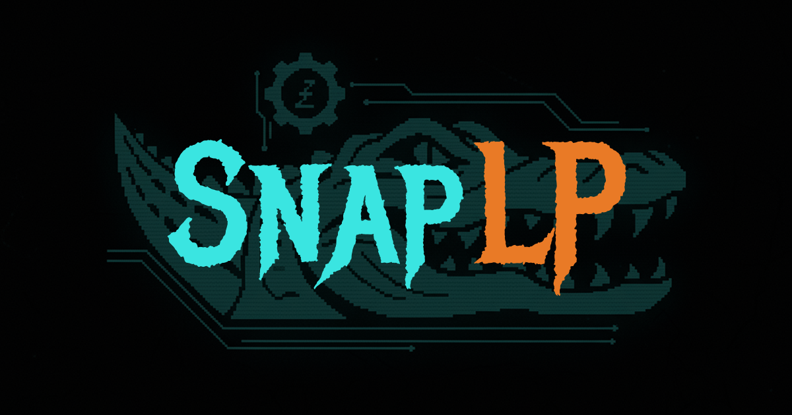

# SnapLP - DLMM Strategy Templates

[](https://opensource.org/licenses/MIT)
[](https://nextjs.org/)
[](https://solana.com/)

> **Saros DLMM Demo Challenge Submission**
> **Live Demo:** [https://snaplp.vercel.app](https://snaplp.vercel.app)

Transform complex DLMM liquidity provision into one-click deployments with pre-configured strategy templates.



---

## 💡 The Idea

**DLMM is powerful but overwhelming.** Most users struggle with bin configuration, range selection, and distribution strategies.

**SnapLP solves this** by providing pre-built strategy templates that abstract away the complexity:
- **Select a pool** → Browse DLMM pools with real-time metrics
- **Choose a template** → Pick from Conservative, Balanced, or Aggressive strategies
- **Get AI guidance** → SNAP Score evaluates strategy-pool compatibility
- **Test first** → Interactive simulator shows potential outcomes
- **Deploy instantly** → One-click deployment with wallet confirmation

No manual bin configuration. No complex calculations. Just smart, pre-optimized strategies ready to deploy.

---

## ✨ Key Features

### 1. Strategy Template Library
Pre-configured DLMM strategies for different risk profiles:
- **Conservative:** Tight ranges (±5%), minimal IL, steady fees
- **Balanced:** Medium ranges (±12.5%), balanced risk/reward
- **Aggressive:** Wide ranges (±25%), maximum fee capture

Each template includes optimized bin count, distribution, and concentration settings.

### 2. AI-Powered SNAP Score
Real-time evaluation using Google Gemini AI across 4 dimensions:
- **Market Fit:** Pool volatility and volume analysis
- **Efficiency:** Capital utilization and fee potential
- **Safety:** IL risk and range sustainability
- **Adaptability:** Strategy resilience to market changes

Grade scale: **S** (90+) • **A** (80+) • **B** (70+) • **C** (60+) • **D** (<60)

### 3. Interactive Simulator
Test strategies before deployment:
- Price range sliders with real-time bin visualization
- Live IL, ROI, and fee estimates
- Investment amount scenarios
- Current pool price indicators

### 4. Portfolio Management
Track and manage your DLMM positions:
- Real-time position tracking with in-range/out-of-range status
- Token balances and accumulated fees display
- One-click fee claiming and liquidity removal
- Helpful tooltips explaining position states

---

## 🛠️ Tech Stack

- **Framework:** Next.js 15.5.4 (App Router, React 19, TypeScript)
- **DLMM SDK:** `@saros-finance/dlmm-sdk` v0.0.19
- **Blockchain:** Solana Devnet
- **Wallet:** `@solana/wallet-adapter-react` (Phantom, Solflare, Backpack)
- **AI Engine:** Google Gemini 1.5 Flash
- **Styling:** Tailwind CSS v4 with console-inspired aesthetics
- **State:** Zustand
- **UI:** Radix UI, Recharts

---

## 🚀 Quick Start

### Prerequisites
- Node.js 18+
- Solana wallet (Phantom/Solflare/Backpack)
- Devnet SOL ([Get from faucet](https://faucet.solana.com/))

### Installation

```bash
# Clone the repository
git clone https://github.com/nikola0x0/snap-lp.git
cd snap-lp

# Install dependencies
npm install

# Set up environment
cp .env.example .env.local
# Edit .env.local with your Gemini API key

# Run development server
npm run dev
```

Open [http://localhost:3000](http://localhost:3000)

### Environment Variables

```env
# Solana
NEXT_PUBLIC_SOLANA_RPC_URL=https://api.devnet.solana.com
NEXT_PUBLIC_SOLANA_NETWORK=devnet
NEXT_PUBLIC_DLMM_PROGRAM_ID=LBUZKhRxPF3XUpBCjp4YzTKgLccjZhTSDM9YuVaPwxo

# AI (Server-side only)
GEMINI_API_KEY=your_key_here
```

---

## 📖 Usage

1. **Connect Wallet** - Click "Connect Wallet" in the header
2. **Select Pool** - Browse and choose a DLMM pool
3. **Pick Template** - Select Conservative, Balanced, or Aggressive
4. **Check SNAP Score** - Review AI-powered compatibility analysis
5. **Simulate (Optional)** - Test the strategy with price scenarios
6. **Deploy** - One-click deployment with wallet confirmation
7. **Manage** - Track positions, claim fees, remove liquidity in Portfolio

---

## 🎨 Design Philosophy

**Console Aesthetic:** Inspired by terminal interfaces with a cyberpunk twist
- **Colors:** Cyan (`#22d3ee`), Green (`#4ade80`), Amber (`#fbbf24`)
- **Typography:** Abel for UI, Share Tech Mono for data displays
- **Layout:** Sharp borders, deep blacks, glowing effects
- **UX:** Clear information hierarchy, minimal clicks to action

---

## 🏗️ Architecture

### Key Components
```
src/
├── app/
│   ├── api/                    # SNAP Score, pool data APIs
│   ├── layout.tsx              # Root layout with metadata
│   └── page.tsx                # Main dashboard
├── components/
│   ├── dashboard-sections/     # Pools, Templates, Deploy, Portfolio
│   ├── strategy-simulator.tsx  # Interactive simulator
│   ├── snap-score-gauge.tsx    # AI score visualization
│   └── wallet-provider.tsx     # Solana wallet integration
├── constants/
│   ├── supported-pools.ts      # DLMM pool configurations
│   ├── strategy-templates.ts   # Template definitions
│   └── token-images.ts         # Token icon mappings
├── store/
│   └── app-store.ts            # Zustand state management
└── lib/
    └── dlmm-service.ts         # DLMM SDK wrapper
```

### DLMM Integration
```typescript
// Centralized service for all DLMM operations
const dlmmService = new LiquidityBookServices({
  mode: MODE.DEVNET,
  options: { rpcUrl: process.env.NEXT_PUBLIC_SOLANA_RPC_URL },
});

// Get user positions
const positions = await dlmmService.getUserPositions({
  payer: publicKey,
  pair: pairAddress,
});

// Calculate position amounts from bin reserves
const binsReserve = await dlmmService.getBinsReserveInformation({
  position: positionPublicKey,
  pair: pairAddress,
  payer: publicKey,
});
```

---

## 🎯 Why SnapLP?

**For Users:**
- Removes DLMM complexity barrier
- Pre-optimized strategies from day one
- AI guidance for better decisions
- Risk-free testing before deployment

**For Developers:**
- Educational reference implementation
- Clean DLMM SDK integration patterns
- Reusable template system architecture
- Production-ready code quality

**For Ecosystem:**
- Increases DLMM adoption
- Reduces bad positions from configuration errors
- Community-driven template marketplace potential
- Foundation for advanced DeFi tools

---

## 🚢 Deployment

### Vercel (One-Click)
[](https://vercel.com/new/clone?repository-url=https://github.com/nikola0x0/snap-lp)

### Manual
```bash
npm run build
npm start
```

Set environment variables in your deployment platform.

---

## 🗺️ Future Vision

- **Mainnet Support** - Deploy real strategies with real assets
- **Template Marketplace** - Community-created strategy sharing
- **Auto-Rebalancing** - Automated position management bots
- **Advanced Analytics** - Performance tracking and optimization
- **Mobile App** - Native iOS/Android experience
- **Integration Hub** - Connect with other Saros products

---

## 📄 License

MIT License - see [LICENSE](LICENSE) file for details.

---

## 🙏 Acknowledgments

- **Saros Finance** for the DLMM SDK and ecosystem
- **Solana** for the infrastructure
- **Superteam** for the bounty opportunity
- **shadcn/ui** for beautiful components

---

## 📞 Contact

**Developer:** nikola0x0
**Live Demo:** [https://snaplp.vercel.app](https://snaplp.vercel.app)
**Repository:** [https://github.com/nikola0x0/snap-lp](https://github.com/nikola0x0/snap-lp)

For questions or support:
- Open an issue on GitHub
- Join [Saros Dev Station](https://discord.gg/saros)

---

<div align="center">

**Built for the Solana & Saros ecosystem**

⭐ **Star this repo if you find it helpful!** ⭐

</div>
